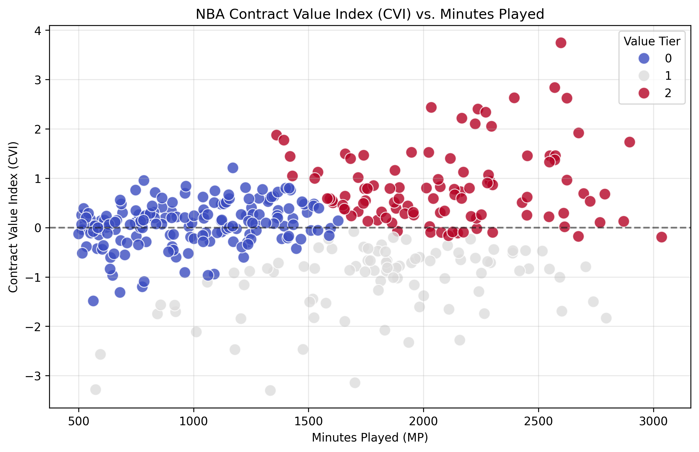
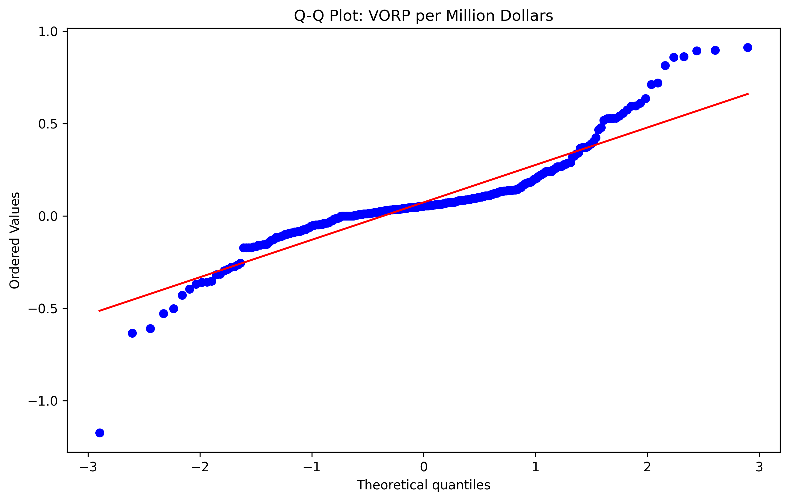
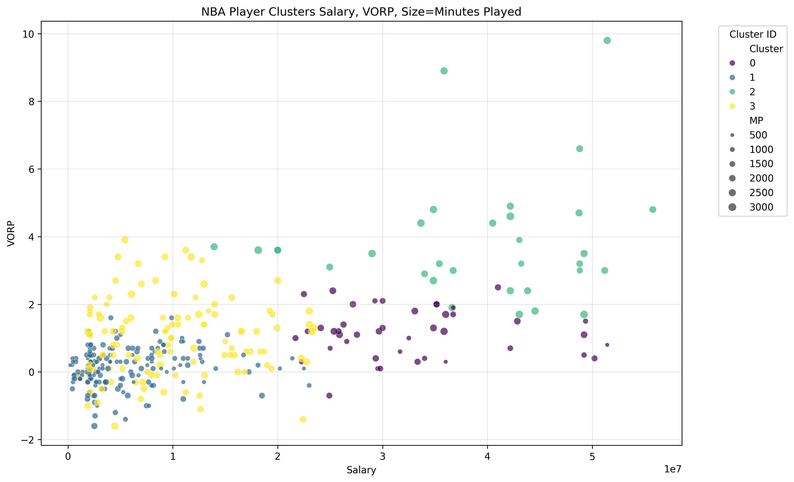

# DATA-375-NBA-Contract-Value-Index
Within the modern NBA, discovering new metrics that are key insights to defining a players skillset are crucial. This project answers a core sports analytics question: "Which NBA player provides the highest on court value relative to their skillset and contract?"
### CVI vs. Minutes Played Evaluation

### Outlier Detection (Q-Q Analysis)

### Structural Segmenting via K-Means Clustering

I worked with a team of people to best answer this, each with a job just as important and dependant on the others. I was tasked with the Statistical Analysis & Visualizations. Initially I began by calculating rate metrics from the data I was given, such as Win Shares per 48 minutes and Value Over Replacement Player (VORP) per miillion dollars. I found these metrics to build a new one, Contract Value Index (CVI); and also find statistical insights that would prove CVI is a good measure. Next I ran a QQ plot on VORP/million to identify outliers, finding that the tails of the distribution broke the normal curve the most. I also ran structural segmenting with a K-Clustering visualization based on Minutes Player, VORP, and Salary. This helped me identify players of categories: Superstars, Value Assests, Overpaid, and Rotation. Finally I developed the CVI metric,
$$CVI = \frac{Z(\text{VORP}) + Z(\text{WS})}{2} - Z(\text{Salary})$$, and graphed players based on Minutes Played to display a breakdown of team assests.

